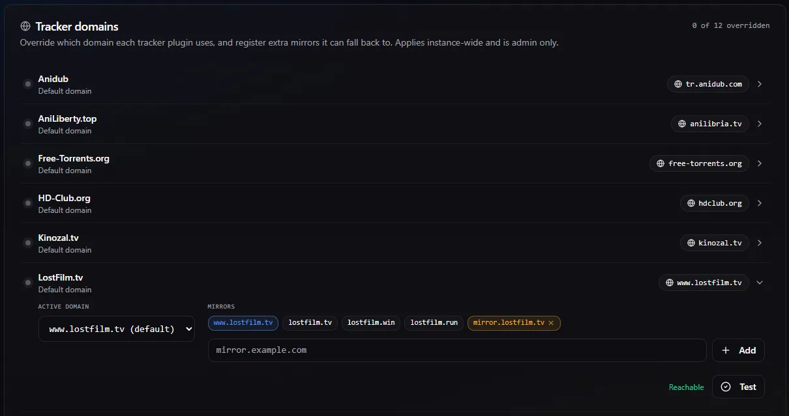

<div align="center">

# 🦉 Marauder

### *The forum-tracker monitor that stayed up to date.*

**A modern, self-hosted torrent topic monitor for the trackers the *arr stack can't reach.**

[](LICENSE)
[](CHANGELOG.md)

[](https://github.com/artyomsv/marauder/actions/workflows/ci.yml)
[](https://github.com/artyomsv/marauder/actions/workflows/codeql.yml)
[](https://github.com/artyomsv/marauder/actions/workflows/docker.yml)
[](https://github.com/artyomsv/marauder/actions/workflows/e2e.yml)
[](https://github.com/artyomsv/marauder/actions/workflows/client-acceptance.yml)
[](https://github.com/artyomsv/marauder/actions/workflows/site.yml)

[](backend/)
[](frontend/)
[](deploy/)
[](docs/plugin-development.md)
[](docs/plugin-development.md)
[](docs/plugin-development.md)
[](docs/torznab-newznab.md)
[](https://marauder.cc)

**[marauder.cc](https://marauder.cc)** &middot; [Vision](docs/VISION.md) · [Competitors](docs/COMPETITORS.md) · [PRD](docs/PRD.md) · [Roadmap](docs/ROADMAP.md) · [Changelog](CHANGELOG.md)

</div>

---

## What is Marauder?

Marauder watches torrent tracker topics (RuTracker, LostFilm, Kinozal, NNM-Club,
Anilibria, and friends) for updates and **automatically hands the new
`.torrent` file or magnet link to your torrent client** — qBittorrent,
Transmission, Deluge, uTorrent, or a simple download folder.

It is built in 2026 with a tightly focused set of modern tools:

- **Go** backend — single static binary, ~50 MB image, bounded memory.
- **React 19 + Vite 8 + Tailwind 4 + shadcn/ui** frontend — genuinely modern,
  dark-first, keyboard-friendly.
- **PostgreSQL 18.4** for state.
- **Internal JWT + OIDC (Keycloak / Authentik / any OIDC provider)** for auth.
- **Plugin architecture** for trackers, clients, and notifiers.
- **Sonarr integration** — auto-monitor the updateable forum-tracker topics
  Sonarr grabs but can't keep watching. See
  [docs/sonarr-integration.md](docs/sonarr-integration.md).
- **Configurable tracker domains + mirror fallback** — point a tracker at a
  working mirror when its primary domain is blocked, and Marauder rotates to the
  next mirror automatically on network failures — without recreating a single
  topic. See [docs/tracker-domains.md](docs/tracker-domains.md).
- **Observable** from day one — Prometheus metrics, structured logs,
  `/health`, `/ready`.

<div align="center">
  
  <br />
  <sub><em>Settings → Tracker domains — pick a working mirror per tracker, and Marauder falls back automatically.</em></sub>
</div>

---

## Why another one?

The short version:

> Sonarr, Radarr, and Prowlarr dominate the Torznab/Newznab world. None of
> them can monitor a RuTracker forum thread, because RuTracker isn't a
> Torznab indexer — it's a forum. The Python-era tools that historically
> filled this niche have stalled. Marauder picks up where they left off,
> built on a modern stack with first-class security, observability, and a
> plugin model designed to be easy to extend. And it doesn't compete with
> Sonarr — it integrates: Marauder auto-takes-over monitoring of the forum
> topics Sonarr grabs but can't keep watching.

Read the full rationale: [VISION.md](docs/VISION.md) ·
[COMPETITORS.md](docs/COMPETITORS.md).

---

## Project status

**v1.15.1** — latest release (v1.0.0 was the initial production cut;
v1.0.1 was the first release to publish container images to GHCR).

What works **today**:

- Full stack comes up with `docker compose up -d` and four healthy
  containers (db + backend + frontend + nginx gateway).
- Local username/password login with Argon2id, ES256 JWT, refresh-token
  rotation, master-key-encrypted secrets at rest.
- OIDC sign-in via Keycloak (or any OIDC provider). Bring up the
  bundled Keycloak realm with the `sso` compose profile.
- 16 tracker plugins, 5 torrent-client plugins, 4 notifier plugins.
- In-app cross-tracker search: type a title in the Add-topic form,
  pick a result, monitor it — no browser trip to find the topic URL
  (Rutor, Kinozal, LostFilm, Anilibria public; RuTracker with a
  stored account).
- Generic-magnet → qBittorrent end-to-end pipeline validated against
  a real qBittorrent docker container — see
  [`docs/test-e2e-magnet.md`](docs/test-e2e-magnet.md).
- Cloudflare-bypass sidecar (`cfsolver` profile) for trackers wrapped
  in CF interstitials.
- Audit log, Prometheus metrics, structured JSON logs, system status
  page.
- English + Russian UI.

**Validated end-to-end**: the generic magnet and `.torrent`-URL paths,
the Torznab/Newznab indexer adapters, the **RuTracker**, **LostFilm**
(including interactive captcha login), and **Kinozal** plugins, and
**NNM-Club** (anonymous-only — its login is Cloudflare-Turnstile-gated,
so accounts aren't supported), each against a live target.

What's still **alpha**: the other 8 CIS forum-tracker plugins
(Anilibria, Anidub, Rutor, Toloka, Unionpeer,
Tapochek, Free-Torrents, HD-Club) are structurally complete with
fixture-based tests but have not been validated against live sites —
that requires real account credentials and is the first thing
community contributors will help with. See [CHANGELOG.md](CHANGELOG.md)
for the per-plugin status table.

---

## Quick start

> Marauder runs as a Docker Compose stack. The only thing you need on the
> host is Docker — no Go, Node, or Postgres toolchain. Full walkthrough:
> **[docs/getting-started.md](docs/getting-started.md)**.

### Run it — prebuilt images (recommended)

Pull the published, multi-arch, signed images from GitHub Container Registry.
No clone, no local build:

```bash
mkdir marauder && cd marauder

# 1. Compose file + example env
curl -fsSLO https://raw.githubusercontent.com/artyomsv/marauder/main/deploy/docker-compose.ghcr.yml
curl -fsSL  https://raw.githubusercontent.com/artyomsv/marauder/main/deploy/.env.example -o .env

# 2. Generate the required 32-byte master key
sed -i "s|MARAUDER_MASTER_KEY=.*|MARAUDER_MASTER_KEY=$(openssl rand -base64 32)|" .env

# 3. Pull + start
docker compose -f docker-compose.ghcr.yml --env-file .env up -d

# 4. Open http://localhost:34080
```

Requires Docker Compose **v2.23.1+**. Pin the release with `MARAUDER_VERSION`
in `.env` (defaults to `1.15.1`); `latest` also exists.

### Build from source (contributors)

```bash
git clone https://github.com/artyomsv/marauder.git
cd marauder/deploy
cp .env.example .env
sed -i "s|MARAUDER_MASTER_KEY=.*|MARAUDER_MASTER_KEY=$(openssl rand -base64 32)|" .env
docker compose --env-file .env up -d   # first run compiles the images
```

On first start, Marauder creates an admin user from
`MARAUDER_ADMIN_INITIAL_USERNAME` / `MARAUDER_ADMIN_INITIAL_PASSWORD` in the
`.env` file. **Change the password after first login and unset those
variables.**

---

## Architecture at a glance

```
         ┌──────────────┐
         │  React 19    │  shadcn/ui + Tailwind 4 + TanStack Query
         │  frontend    │
         └──────┬───────┘
                │ JSON over HTTPS
                ▼
         ┌──────────────┐       ┌──────────────┐
         │   Go backend │──────►│  PostgreSQL  │
         │   chi + pgx  │       │  18.4        │
         └──┬────┬──────┘       └──────────────┘
            │    │
            │    └──────────┐
            ▼               ▼
     ┌────────────┐   ┌──────────────┐
     │  Tracker   │   │   Torrent    │
     │  plugins   │   │   clients    │
     │ (rutracker,│   │ (qBittorrent,│
     │  lostfilm, │   │  Transmission│
     │  nnm-club, │   │  Deluge,     │
     │   ...)     │   │  ...)        │
     └─────┬──────┘   └──────────────┘
           │
           │ (Cloudflare-protected trackers only)
           ▼
     ┌────────────┐
     │ cfsolver   │  sidecar container: chromium + chromedp
     │ sidecar    │
     └────────────┘

     Optional: ────────────────────────────────────────
     OIDC (Keycloak / Authentik / Authelia) for SSO.
     Prometheus + Grafana for metrics.
     Telegram / Email / Webhook / Pushover for notifications.
```

---

## Tech stack

| Layer | Choice | Why |
|---|---|---|
| Backend | Go 1.23+ | Fast, simple concurrency, single binary, mature HTTP/scraping ecosystem, friendly to contributors. See PRD §2. |
| HTTP router | `chi` | Stdlib-idiomatic, middleware composable, minimal. |
| DB driver | `pgx` v5 + `sqlc` | Type-safe queries generated from SQL. |
| Migrations | `goose` | Embedded, runs at startup, simple. |
| Logging | `zerolog` | Structured, allocation-free. |
| Config | `envconfig` | 12-factor, no YAML. |
| Frontend | React 19.2 + TypeScript | Latest stable, Server Components optional. |
| Build | Vite 8.0.2 | Fast HMR, plugin ecosystem. |
| Styling | Tailwind CSS 4.2 | New `@tailwindcss/vite` plugin, no PostCSS headaches. |
| UI kit | shadcn/ui 4.1.2 | Copy-in components, no vendor lock-in. |
| State | TanStack Query v5 + Zustand | Server state + minimal global UI state. |
| Forms | react-hook-form + zod | |
| Database | PostgreSQL 18.4 | |
| Auth | Internal JWT (ES256) + OIDC (Keycloak etc.) | |
| Secrets | AES-256-GCM at rest | |
| Observability | Prometheus + structured JSON logs | |
| Packaging | Docker + docker-compose | No host dependencies. |
| CI | GitHub Actions | Lint, unit, integration, e2e, trivy, govulncheck. |

---

## Repository layout

```
marauder/
├── backend/            Go backend (chi, pgx, sqlc, goose)
├── frontend/           React 19 + Vite 8 + Tailwind 4 + shadcn
├── deploy/             docker-compose files, .env.example, nginx configs
├── docs/               VISION / COMPETITORS / PRD / ROADMAP / guides
├── CHANGELOG.md        Keep a Changelog format
├── LICENSE             MIT
└── README.md
```

---

## Contributing

Marauder is meant to be easy to extend. Adding a new tracker is a single Go
file implementing the [`Tracker`](docs/PRD.md#51-tracker-plugin-contract)
interface plus a recorded-HTTP-fixture test. The full contribution guide is in
[CONTRIBUTING.md](CONTRIBUTING.md) (coming in v0.2).

For now:

- **Open issues** for bugs, feature ideas, or tracker breakage reports.
- **Discuss design** before large PRs — a quick issue saves a lot of rebasing.
- **Don't** submit PRs adding hard-coded tracker URLs pointing at copyrighted
  content. Marauder is an automation tool, not an index.

---

## License & credits

Marauder is released under the [MIT License](LICENSE).

Built inspired by [monitorrent](https://github.com/werwolfby/monitorrent) — the
project that pioneered the forum-tracker monitoring niche. Marauder is an
independent, ground-up implementation, but the problem statement and the user
experience it targets are owed to that earlier work.

---

## Legal notice

Marauder is a general-purpose automation tool. It does not host content and
does not ship with any pre-configured tracker URLs. What you choose to
monitor and download is **your responsibility** and subject to the laws of
your jurisdiction and the terms of service of the trackers you use.
